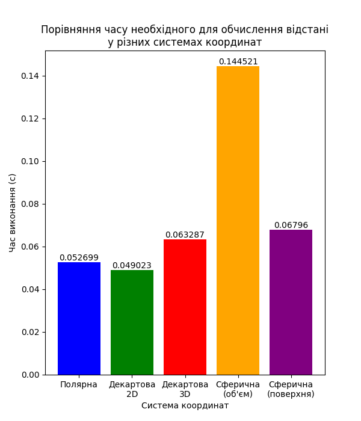

# coordinate-transformations

Ознайомлення з різними системами координат (декартовою, полярною та сферичною) та отримання
практичних навичок у переході між ними. Визначення обчислювальної ефективності розрахунку відстаней
у цих системах координат через бенчмаркінг.

## Перехід між системами координат

Процес переходу між системами координат включає в себе математичні перетворення, що дозволяють
перевести координати з однієї системи в іншу, зберігаючи правильність відстаней та розташування
точок у просторі. Основні етапи переходу:

1. **Полярні координати → Декартові (2D)**:

   - Формули перетворення:
     - $x = r \cdot \cos(\theta)$
     - $y = r \cdot \sin(\theta)$
   - Полярні координати визначають точку через радіус і кут, а декартові — через прямі координати.

2. **Декартові (2D) → Полярні**:

   - Формули перетворення:
     - $r = \sqrt{x^2 + y^2}$
     - $\theta = \text{atan2}(y, x)$
   - Це перетворення дозволяє визначити відстань і кут від початку координат до точки.

3. **Сферичні координати → Декартові (3D)**:

   - Формули перетворення:
     - $x = r \cdot \sin(\phi) \cdot \cos(\theta)$
     - $y = r \cdot \sin(\phi) \cdot \sin(\theta)$
     - $z = r \cdot \cos(\phi)$
   - Сферичні координати використовують радіус, два кути для визначення точки в тривимірному
     просторі.

4. **Декартові (3D) → Сферичні**:
   - Формули перетворення:
     - $r = \sqrt{x^2 + y^2 + z^2}$
     - $\theta = \text{atan2}(y, x)$
     - $\phi = \text{acos}(z / r)$
   - Для отримання сферичних координат з декартових потрібно розрахувати відстань до точки, а також
     два кути: азимутальний і полярний.

## Перевірка коректності розрахунків:

Перевірка коректності виконана за допомогою порівняння результатів перетворень. Використовуються
функції `math.isclose()`, щоб перевірити, чи є різниця між початковими та отриманими координатами в
межах заданої точності (відносна похибка `1e-5`). Якщо умови не виконуються, видається повідомлення
про некоректне перетворення.

## Результати бенчмаркінгу

## Висновок

Полярна система координат є найефективнішою для задач, пов'язаних з обертаннями, радіусами або
спіралями, але не підходить для складних 3D обчислень.

Декартова система координат є універсальною і найбільш ефективною для більшості стандартних задач у
2D та 3D.

Сферична система координат є незамінною в специфічних сферах, де потрібна точність для розрахунків
на сферичних поверхнях або в об'ємах, наприклад, для астрономічних або географічних даних.
